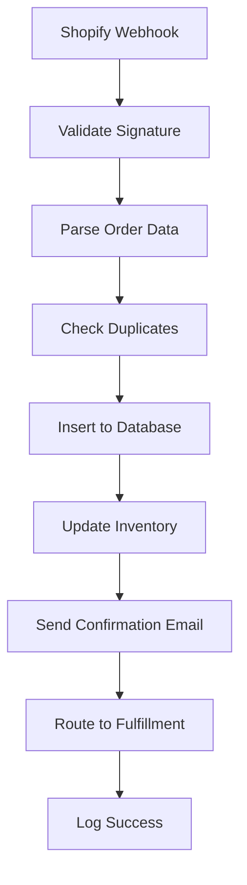
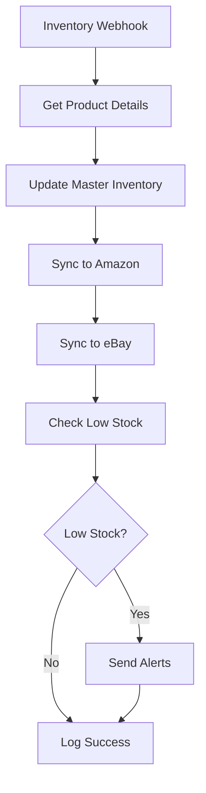

# Shopify Automation System Architecture

## Overview

The Shopify Automation System is a comprehensive, event-driven platform that automates order processing, inventory management, customer support, and fulfillment operations for e-commerce businesses.

## System Architecture

```
┌─────────────────┐    ┌─────────────────┐    ┌─────────────────┐
│   Shopify Store │    │   Amazon/eBay   │    │   Chat Widget   │
│                 │    │   Marketplaces  │    │                 │
└─────────┬───────┘    └─────────┬───────┘    └─────────┬───────┘
          │                      │                      │
          │ Webhooks             │ API Calls            │ WebSocket
          ▼                      ▼                      ▼
┌─────────────────────────────────────────────────────────────────┐
│                    AWS Lambda Layer                          │
├─────────────────┬─────────────────┬───────────────────────┤
│  order-router   │ inventory-sync  │      chatbot          │
│                 │                 │                       │
│ • Webhook       │ • Multi-channel │ • OpenAI Integration │
│   Validation    │   Sync          │ • Conversation Mgmt  │
│ • Order Processing│ • Low Stock     │ • Escalation        │
│ • Database Ops  │   Alerts         │ • Confidence Scoring │
└─────────────────┴─────────────────┴───────────────────────┘
          │                      │                      │
          ▼                      ▼                      ▼
┌─────────────────────────────────────────────────────────────────┐
│                  Make.com Workflow Layer                     │
├─────────────────┬─────────────────┬───────────────────────┤
│ Order Capture   │ Inventory Sync  │  Email Automation    │
│                 │                 │                       │
│ • Order → DB    │ • Channel Sync  │ • Confirmations      │
│ • Fulfillment    │ • Amazon/eBay   │ • Shipping Updates   │
│ • Tracking      │ • Reorder       │ • Follow-ups         │
└─────────────────┴─────────────────┴───────────────────────┘
          │                      │                      │
          ▼                      ▼                      ▼
┌─────────────────────────────────────────────────────────────────┐
│                   External Services                           │
├─────────────────┬─────────────────┬───────────────────────┤
│   PostgreSQL    │   ShipStation   │     SendGrid          │
│                 │                 │                       │
│ • Orders        │ • Fulfillment   │ • Email Delivery     │
│ • Inventory     │ • Tracking      │ • Templates          │
│ • Conversations │ • Returns       │ • Analytics          │
└─────────────────┴─────────────────┴───────────────────────┘
          │                      │                      │
          ▼                      ▼                      ▼
┌─────────────────────────────────────────────────────────────────┐
│                React Dashboard                              │
│                                                         │
│ • Real-time Orders    • Inventory Management                │
│ • System Health      • Support Chat                       │
│ • Analytics         • Automation Logs                    │
└─────────────────────────────────────────────────────────────────┘
```

## Core Components

### 1. AWS Lambda Functions

#### Order Router (`order-router`)
- **Purpose**: Primary webhook handler for Shopify order events
- **Triggers**: Shopify webhooks (orders/create, orders/updated, refunds/create)
- **Responsibilities**:
  - Webhook signature validation
  - Order data normalization
  - Database operations
  - Idempotency handling
  - Error classification and retry logic

#### Inventory Sync (`inventory-sync`)
- **Purpose**: Multi-channel inventory synchronization
- **Triggers**: Shopify inventory webhooks, scheduled runs
- **Responsibilities**:
  - Real-time inventory updates
  - Channel synchronization (Shopify → Amazon → eBay)
  - Low stock detection
  - Automated reorder triggers

#### Chatbot (`chatbot`)
- **Purpose**: AI-powered customer support
- **Triggers**: Customer chat messages
- **Responsibilities**:
  - OpenAI GPT integration
  - Conversation management
  - Confidence scoring
  - Human escalation logic

### 2. Database Schema

#### Core Tables
- **orders**: Master order records
- **order_items**: Order line items
- **inventory**: Master inventory records
- **inventory_levels**: Channel-specific inventory
- **support_conversations**: Chat sessions
- **automation_logs**: System audit trail

#### Design Principles
- Normalized data structure
- Foreign key constraints
- Optimized indexes
- Audit trails with timestamps

### 3. Make.com Workflows

#### Order Capture Workflow


#### Inventory Sync Workflow


### 4. React Dashboard

#### Architecture
- **Frontend**: React 18 with Vite
- **State Management**: React Query
- **UI Framework**: Tailwind CSS
- **Charts**: Recharts
- **Real-time**: WebSocket connections

#### Pages
- **Dashboard**: Overview with metrics and charts
- **Orders**: Order management and filtering
- **Inventory**: Multi-channel inventory view
- **Health**: System monitoring and alerts
- **Support**: Customer conversation management

## Data Flow

### Order Processing Flow
1. **Order Created** → Shopify webhook
2. **Webhook Validation** → HMAC signature check
3. **Data Normalization** → Parse and validate order data
4. **Database Storage** → Insert orders and items
5. **Inventory Update** → Adjust stock levels
6. **Email Notification** → Send confirmation
7. **Fulfillment Routing** → Send to ShipStation
8. **Tracking Updates** → Monitor shipment status

### Inventory Sync Flow
1. **Inventory Change** → Shopify webhook or scheduled
2. **Product Lookup** → Get product details
3. **Master Update** → Update central inventory
4. **Channel Sync** → Update Amazon/eBay
5. **Low Stock Check** → Compare to reorder points
6. **Alert Generation** → Send notifications if needed

### Customer Support Flow
1. **Customer Message** → Chat widget
2. **AI Processing** → OpenAI GPT analysis
3. **Response Generation** → Create AI response
4. **Confidence Scoring** → Evaluate response quality
5. **Escalation Check** → Human agent if needed
6. **Conversation Storage** → Log all interactions

## Security Architecture

### Authentication & Authorization
- **Webhook Security**: HMAC signature validation
- **API Security**: JWT tokens, rate limiting
- **Database Security**: Parameterized queries, connection encryption
- **Secret Management**: AWS Secrets Manager, environment variables

### Data Protection
- **PII Protection**: Email and personal data encryption
- **PCI Compliance**: Secure payment data handling
- **GDPR Compliance**: Data retention and deletion policies
- **Audit Logging**: Complete audit trail

## Performance Architecture

### Scalability Design
- **Serverless Functions**: Auto-scaling Lambda
- **Database Scaling**: Read replicas, connection pooling
- **Caching Strategy**: Redis for session data
- **CDN Distribution**: Static asset delivery

### Monitoring & Observability
- **Application Metrics**: Custom metrics collection
- **Infrastructure Monitoring**: CloudWatch integration
- **Error Tracking**: Comprehensive error logging
- **Performance Monitoring**: Response time tracking

## Integration Points

### Shopify Integration
- **Webhooks**: Real-time event notifications
- **Admin API**: Product and order management
- **Storefront API**: Customer-facing features
- **GraphQL**: Efficient data queries

### Third-Party Services
- **ShipStation**: Order fulfillment
- **SendGrid**: Email delivery
- **OpenAI**: AI chatbot
- **Slack**: Team notifications
- **Make.com**: Workflow orchestration

### API Design
- **RESTful Design**: Standard HTTP methods
- **Version Control**: API versioning strategy
- **Documentation**: OpenAPI specifications
- **Error Handling**: Consistent error responses

## Deployment Architecture

### AWS Infrastructure
- **Lambda Functions**: Serverless compute
- **RDS PostgreSQL**: Managed database
- **API Gateway**: HTTP endpoint management
- **CloudWatch**: Monitoring and logging
- **Secrets Manager**: Secure credential storage

### CI/CD Pipeline
- **Source Control**: Git-based workflows
- **Automated Testing**: Unit and integration tests
- **Deployment Automation**: Infrastructure as code
- **Rollback Strategy**: Blue-green deployments

## Disaster Recovery

### Backup Strategy
- **Database Backups**: Automated daily backups
- **Point-in-Time Recovery**: 30-day retention
- **Cross-Region Replication**: Geographic redundancy
- **Data Export**: Regular data exports

### Failover Planning
- **Multi-AZ Deployment**: High availability
- **Health Checks**: Automated monitoring
- **Manual Override**: Emergency procedures
- **Communication Plan**: Stakeholder notifications

## Future Enhancements

### Planned Features
- **Event Replay**: Replay past events for debugging
- **Advanced Analytics**: ML-powered insights
- **Mobile App**: Native mobile dashboard
- **API Rate Limiting**: Advanced throttling

### Scalability Improvements
- **Microservices**: Service decomposition
- **Event Sourcing**: Complete event history
- **CQRS Pattern**: Read/write separation
- **GraphQL Federation**: Distributed GraphQL

This architecture provides a solid foundation for scalable, reliable e-commerce automation while maintaining security and performance standards.
